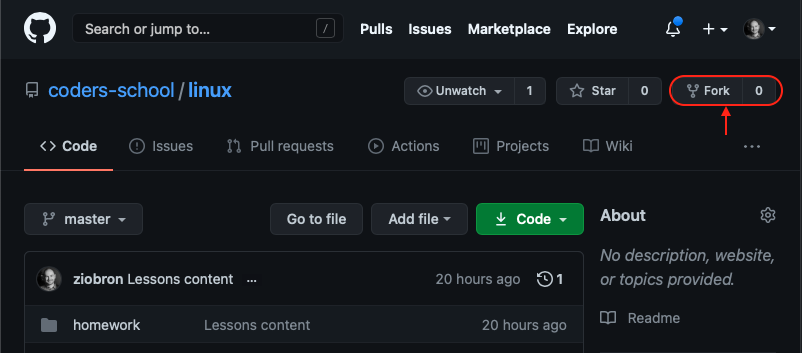
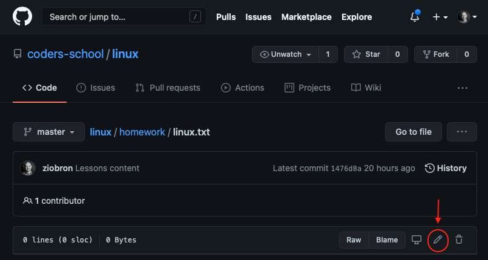
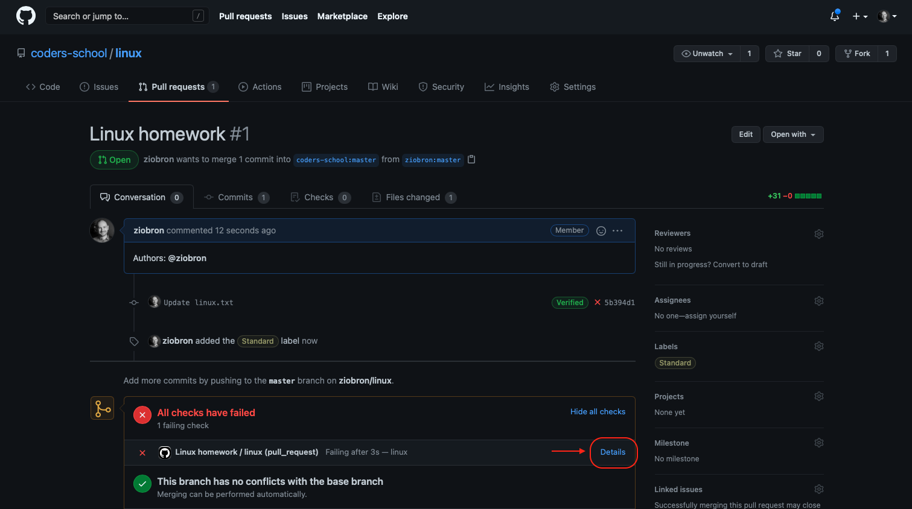

# Narzędzia programisty

## Linux

### Zadanie domowe

Przed wykonaniem zadania upewnij się, że posiadasz konto na GitHubie. [Otwórz to repozytorium](https://github.com/coders-school/linux) w przeglądarce i kliknij przycisk Fork. To utworzy kopię tego repozytorium na Twoim koncie. Dzięki temu możesz je edytować.

Po zakończeniu Twoja kopia będzie dostępna pod adresem https://github.com/NICK/linux, gdzie NICK to nazwa Twojego konta na GitHubie.

### Zadanie domowe (10 XP)

Wykonaj poniższe kroki w terminalu.

1. Utwórz nowy katalog o dowolnej nazwie
2. Utwórz w nim plik o nazwie processes.txt
3. Wpisz do niego wszystkie procesy, które zwraca komenda `ps aux`
4. Skopiuj plik processes.txt do pliku copy.txt
5. Utwórz katalog o nazwie backup i przenieś do niego plik copy.txt
6. Policz ile jest linii w pliku processes.txt
7. Wpisz informację o liczbie linii do nowego pliku o nazwie selected.txt używając przekierowania wejścia
8. Użyj `grep`, aby dowiedzieć się w których liniach pliku processes.txt są procesy, których ścieżka ma w nazwie "/bin" i dopisz je na końcu pliku selected.txt
9. Użyj polecenia `history`, aby zobaczyć ostatnio wpisane komendy i zlokalizuj od której pozycji zaczęło się wykonywanie tego zadania
10. Wynik history przepuść przez tail z odpowiednimi parametrami, aby wyświetlić tylko interesujące nas komendy (z punktu wyżej) i zapisz je w pliku commands.txt
11. Wyświetl w terminalu połączoną zawartość plików selected.txt oraz commands.txt za pomocą jednej komendy.

### Zgłoszenie pracy domowej

1. W swojej kopii repozytorium na GitHubie przejdź do katalogu homework i otwórz plik linux.txt
2. Kliknij ikonę ołówka, aby go edytować.

    

3. Wklej do niego całość tekstu, który pojawił się w terminalu po wpisaniu ostatniej komendy (łącznie z linią zawierającą tę komendę).
4. Kliknij Commit changes. Twoja kopia repozytorium zawiera już pracę domowę.
5. Zgłoś prace domową do sprawdzenia przez automat. Kliknij Code, a potem Pull Request.

    

6. W kolejnym kroku nic nie zmieniaj, tylko kliknij Create Pull Request. Możesz wcześniej przejrzeć jakie są zmiany w Twoim forku względem oryginalnego repozytorium.

    

7. Nadaj jeszcze nazwę i opis swoim zmianom w języku angielskim. Gdy będzie pracować w kilka osób w opisie koniecznie muszą znaleźć się lista autorów.
8. Gotowe! Za chwilę dowiesz się, czy zadanie przeszło testy :)
9. Jeśli widzisz coś takiego, to znaczy, że musisz poprawić swoje rozwiązanie. Gdy klikniesz na Details dowiesz się co poszło nie tak. Napraw to co trzeba i wyedytuj ponownie plik homework/linux.txt w swojej kopii repozytorium. Nie musisz po raz drugi zgłaszać Pull Requesta, zaktualizuje się sam po edycji pliku.

    

#### Powodzenia! 😊
